# 🗺️ Pathly — Smart Travel Planning & Task Management Platform

Pathly is a full-stack MERN (MongoDB, Express.js, React, Node.js) web application designed to help users plan trips, track travel activities and budget, manage task schedules, and visualize locations seamlessly.


## Live Demo & Deployment

* **Frontend Application**: [https://pathly-frontend-8iou.onrender.com]
* **Backend API Base**: [https://mern-project-pathly.onrender.com/api]


## Tech Stack

### Frontend
* **Core Framework**: React.js, TypeScript, Vite
* **Routing**: React Router
* **State & Data Fetching**: React Context API, Axios
* **UI & Styling**: Tailwind CSS, Lucide React Icons
* **Interactive Components**: `@hello-pangea/dnd` (Drag-and-Drop)

### Backend
* **Runtime**: Node.js
* **Framework**: Express.js
* **Database**: MongoDB & Mongoose ODM
* **Security & Auth**: JSON Web Tokens (JWT), Bcrypt.js, CORS Middleware

### Cloud Infrastructure & Deployment
* **Client Hosting**: Render (Static Site with SPA Rewrite Rules)
* **API Hosting**: Render (Web Service)
* **Database Cloud**: MongoDB Atlas


## Key Features & User Capabilities

### 🔐 1. User Authentication & Authorization
* **Secure Registration & Login**: Account creation and authentication backed by **bcrypt** password hashing and **JSON Web Tokens (JWT)**.
* **Persistent Sessions & Auth State**: Global authentication context managing session state with secure token persistence in `localStorage`.
* **Protected Client & Server Routes**: Frontend route wrappers preventing unauthorized navigation, complemented by Express middleware verifying JWT headers on all protected API endpoints.

**Landing Page**
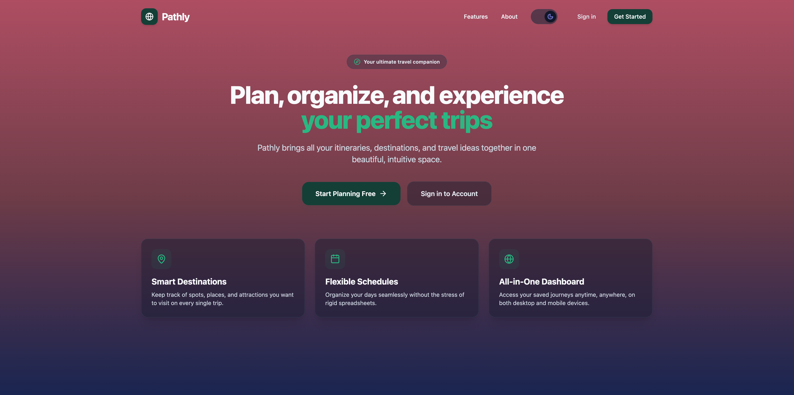

**Sign In Page**
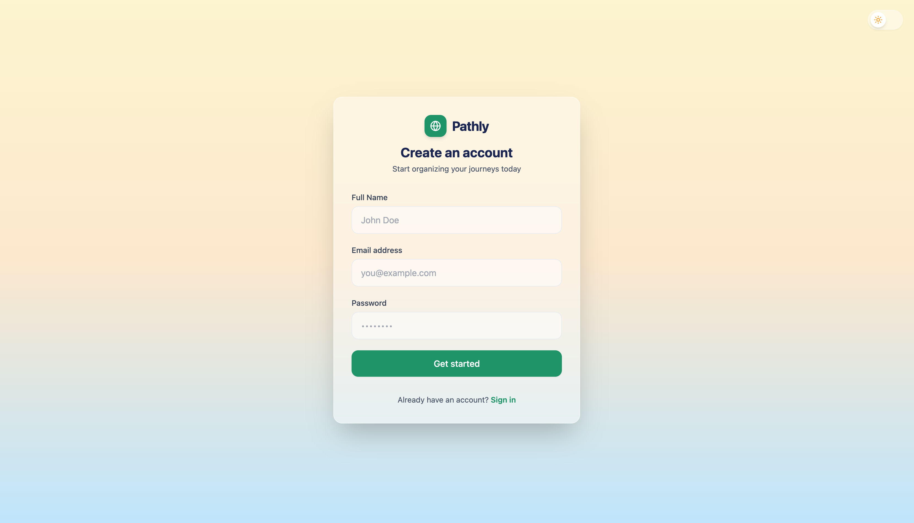

**Login Page**
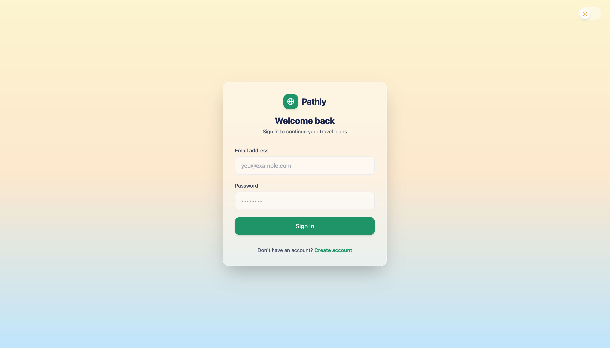
 
### ✈️ 2. Comprehensive Trip Management (Full CRUD)
* **Create Itineraries**: Plan new trips with title, destination, target start/end dates, budget estimates.
* **Read & Overview Dashboard**: Centralized dashboard displaying user-specific trips with visual progress, date ranges, and status badges.
* **Update Trip Details**: Real-time updating of itinerary schedules, destination targets, and trip parameters.
* **Delete Trips**: Safe removal of entire trip itineraries along with their associated activities and tasks.

**Dashboard Page**
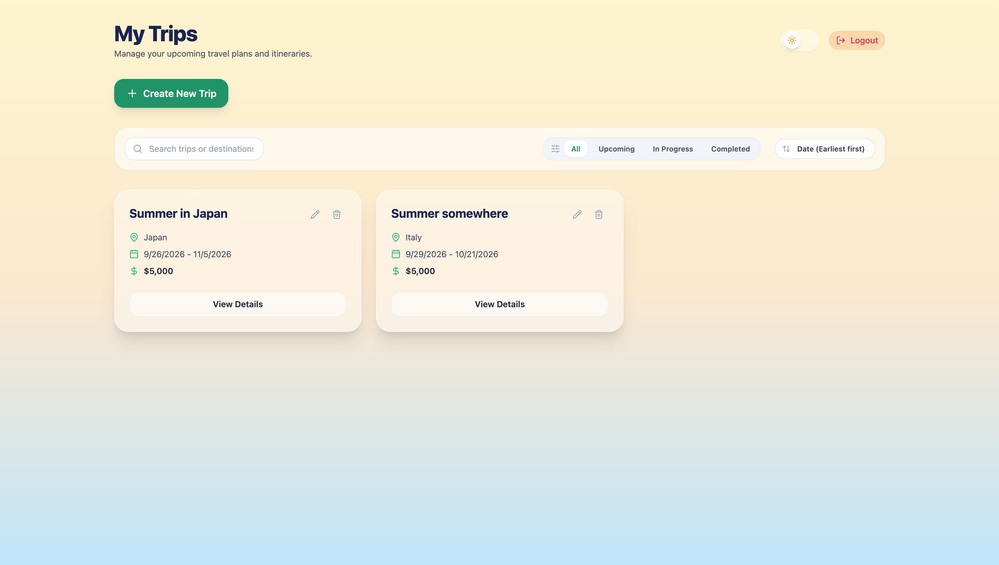

### 📌 3. Activity & Custom Category Management (Full CRUD)
* **Detailed Activity Creation**: Add specific activities to any trip (e.g., museum visits, dining, flight departures) with title, category, scheduled date, location, and status.
* **Custom Category Lifecycle (Full CRUD)**:
  * **Create Categories**: Users can define custom categories with personalized titles.
  * **Delete Categories**: Remove categories with safe fallback/reassignment options for attached activities.
* **Category Filtering**: Dynamically filter activities by standard or custom-created categories across daily timelines.
* **Status Tracking**: Mark activities as *To Do*, *In Progress*, or *Completed*.
* **Activity Edit & Delete**: Complete flexibility to modify activity details or clear scheduled items as plans evolve.

**Trip Page**
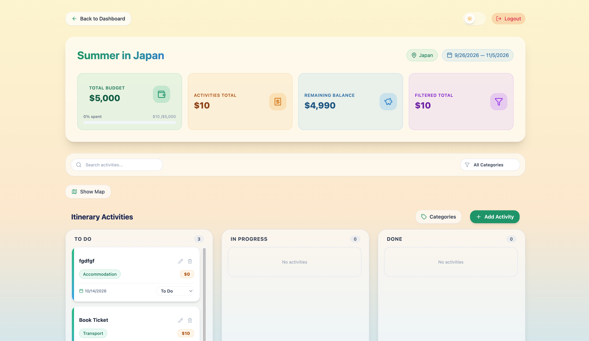

### 🔀 4. Interactive Drag-and-Drop Reordering
* **Intuitive Kanban / Timeline Interface**: Powered by `@hello-pangea/dnd` for smooth, responsive user interactions.
* **Reorder Itinerary Items**: Drag and rearrange activities to seamlessly reorder daily travel schedules.
* **Status Updates via Dragging**: Effortlessly move tasks between different schedule columns.

**Drag and Drop**
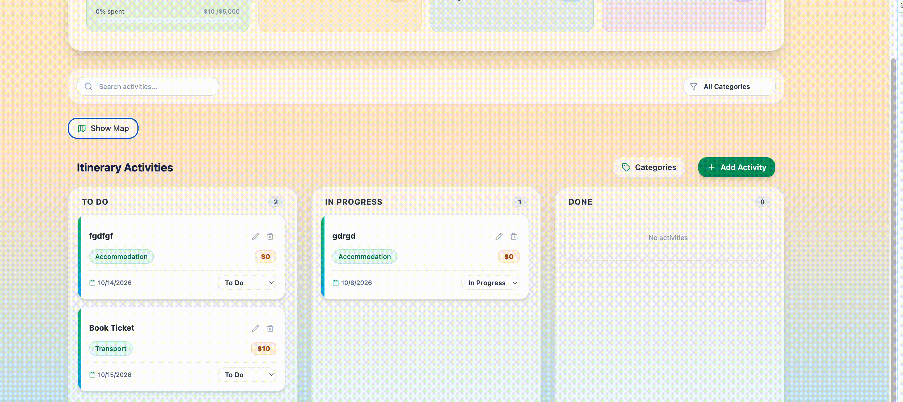

### 🗺️ 5. Visualization & Map Integration
* **Interactive Map View**: Embedded interactive map displaying destination markers for scheduled activities and trip stops.
* **Location Pinning**: Geographic placement of itinerary stops to visualize daily travel routes and proximity between planned events.
* **Route Context**: Enhanced clarity helping users optimize travel time and geographical transitions during trips.

**Map**
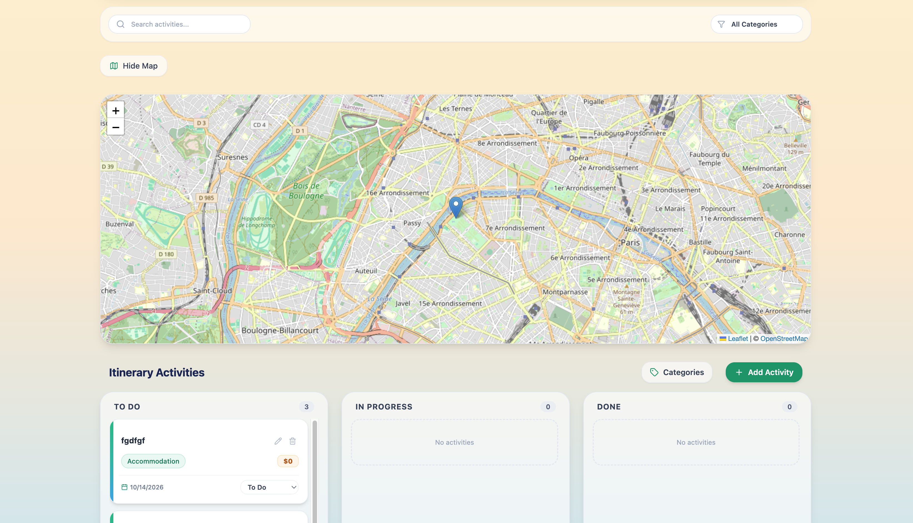

**Map - Mobile**
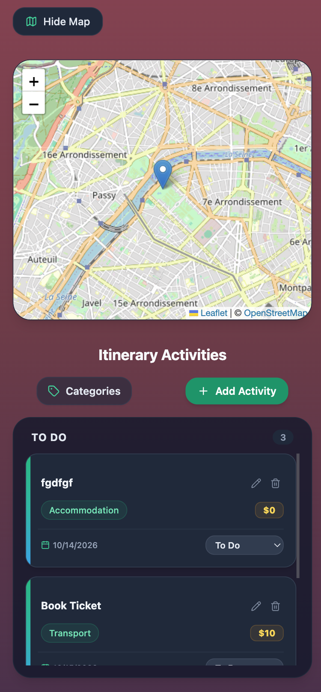

### 🌓 6. Dark / Light Mode Support
* **Theme Toggle**: One-click switching between Light and Dark visual modes.
* **Persistent Theme Preference**: User's chosen theme is saved (e.g., via `localStorage` or React Context) to maintain consistency across sessions and page reloads.
* **Seamless Tailwind Styling**: Fully responsive contrast and accessible color palettes optimized for both bright daytime environments and low-light night viewing.

**Darl Mode**


**Light Mode**
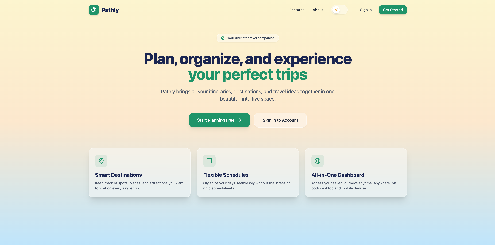

### 📱 7. Fully Responsive Mobile-First Design
* **Cross-Device Compatibility**: Seamless user experience across mobile phones, laptops, and wide desktop monitors.
* **Adaptive Layouts**: Flexible grid and flexbox structures, collapsing sidebars, touch-friendly navigation controls, and mobile-optimized drag-and-drop interactions.

**Trip Detail Page - Desktop**


**Trip Detail Page - Mobile**
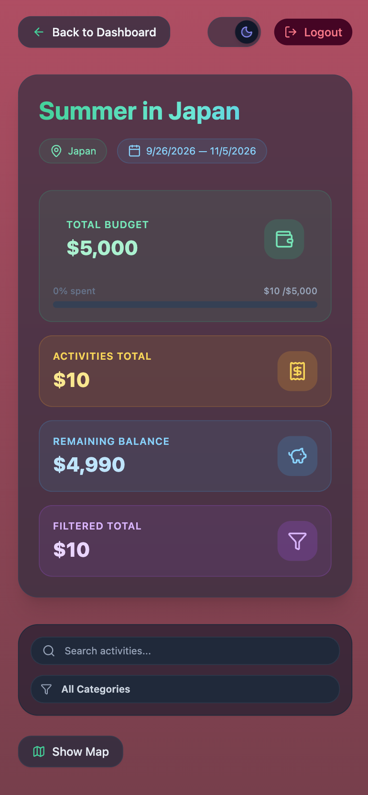
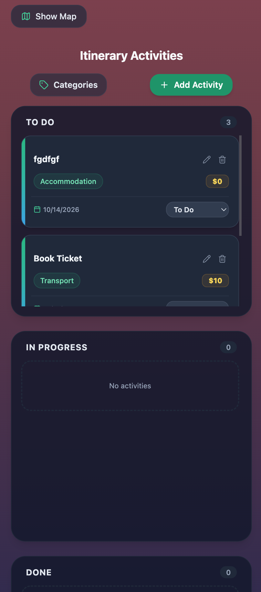

**Trip Detail Page - Mobile - Map**


## Local Development Setup

Follow these steps to get a local copy up and running on your machine.

### Prerequisites
* **Node.js**
* **npm**
* **MongoDB**: Local MongoDB instance or a MongoDB Atlas connection URI


### 1. Clone the Repository
```bash
git clone https://github.com/natalymelnichuk/mern-project-pathly
cd mern-project-pathly
```


### 2. Backend Setup (`/server`)

1. Navigate to the server folder and install dependencies:
   ```bash
   cd server
   npm install
   ```

2. Create a `.env` file in the `server` directory:
   ```env
   PORT=5000
   MONGO_URI=your_mongodb_connection_string
   JWT_SECRET=your_jwt_secret_key
   CORS_ORIGIN=http://localhost:5173
   ```

3. Start the backend server in development mode:
   ```bash
   npm run dev
   ```
   *The server will run on `http://localhost:5000`.*


### 3. Frontend Setup (`/client`)

1. Open a new terminal window, navigate to the client folder, and install dependencies:
   ```bash
   cd client
   npm install
   ```

2. Create a `.env` file in the `client` directory:
   ```env
   VITE_API_URL=http://localhost:5000/api
   ```

3. Start the Vite development server:
   ```bash
   npm run dev
   ```
   *The client app will be accessible at `http://localhost:5173`.*


## Engineering Challenges & Key Solutions

Building **Pathly** involved resolving several complex frontend, backend, and deployment challenges. Below are key technical obstacles encountered during development and how they were solved:

### 1. Client-Side Routing Breaks on Page Refresh in Production (Render Deployment)
* **Challenge**: When hosted on Render as a Static Site, directly refreshing pages or navigating to sub-routes (e.g., `/dashboard` or `/trips/123`) resulted in **404 Not Found** errors because the web server looked for static physical files matching those paths.
* **Solution**: Configured **Single Page Application (SPA) Rewrite Rules** in Render settings, setting the source path `/*` to rewrite to `/index.html` (HTTP 200). This ensures all route handoffs are cleanly managed by **React Router v6**.

### 2. State Synchronization & Drag-and-Drop Order Persistence
* **Challenge**: Reordering items using `@hello-pangea/dnd` caused UI flicker or temporary state rollbacks if the asynchronous API call failed or took too long to persist the updated order index in MongoDB.
* **Solution**: Implemented **Optimistic UI Updates**. The React Context immediately updates local state to reflect the new position for instant UI responsiveness. Simultaneously, a background HTTP request synchronizes the new order with MongoDB, featuring robust error rollback handling if the request fails.

### 3. Dynamic & Customizable Activity Categories 
* **Challenge**: Standard static categories lacked personalization. Implementing user-editable categories required handling dynamic state propagation across activities, handling fallback behavior when a custom category is edited or deleted, and ensuring schema consistency in MongoDB.
* **Solution**: Engineered a dedicated user-owned Category model in Mongoose. Created robust frontend state hooks allowing operations on custom categories with active filtering without corrupting scheduled itinerary items.

### 4. Map Centering & Dynamic Geolocation Viewports
* **Challenge**: The interactive map initially defaulted to fixed coordinates, requiring manual zooming/panning. Calculating dynamic bounds, centering the map viewport based on the destination location, and auto-adjusting zoom levels to fit all active activity markers presented rendering and API synchronization challenges.
* **Solution**: Implemented dynamic geocoding query resolvers paired with automatic bounding-box recalculation. Whenever a trip loads or a destination/activity changes, the map camera recalculates its center coordinates and optimal zoom level to highlight the active itinerary area automatically.

